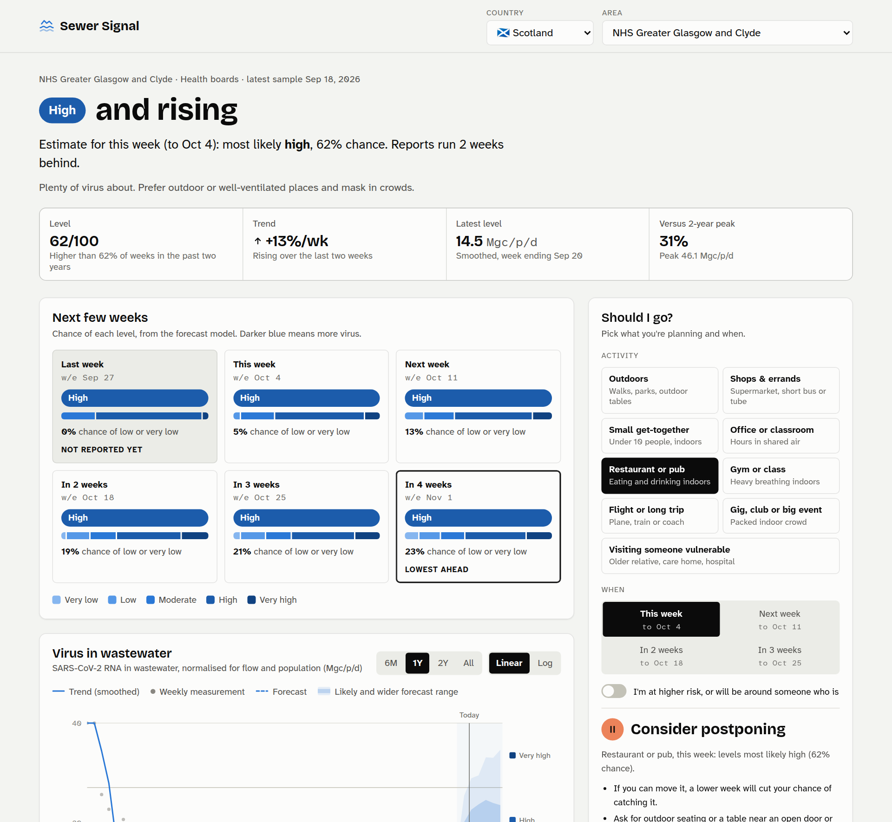
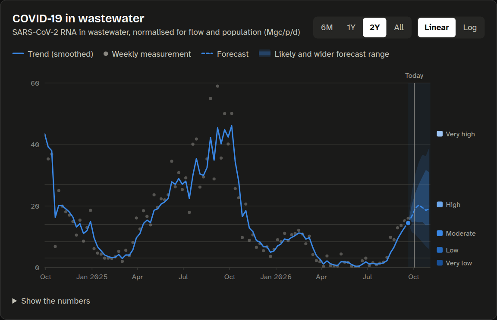
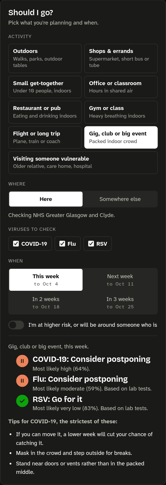
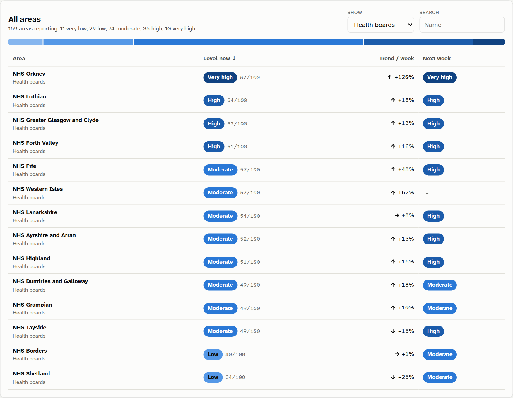
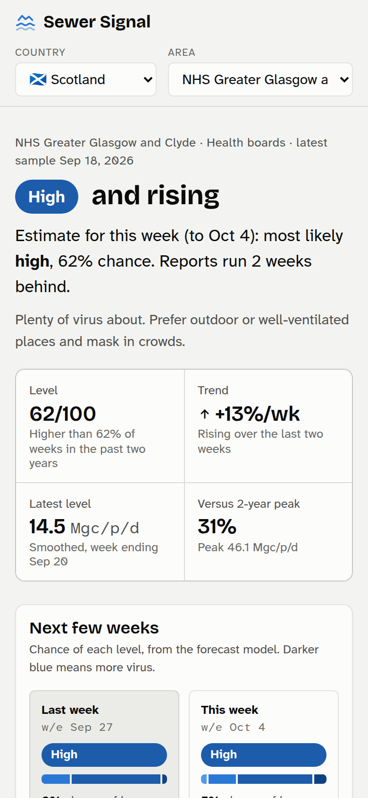

<div align="center">


# Sewer Signal

**How much COVID, flu and RSV is going round where you live, where each is heading over the next
six weeks, and whether now's a good time for that gig, flight or visit to your gran.**

Built on public wastewater surveillance data for Scotland, the United States, Canada, Germany,
the Netherlands and New Zealand.

[](https://github.com/thetrueartist/covidWasteWaterVisualisorPredictor/actions/workflows/ci.yml)
[](https://github.com/thetrueartist/covidWasteWaterVisualisorPredictor/actions/workflows/pages.yml)


[](LICENSE)



</div>

## What it does

- **Tells you the level right now.** Each area's wastewater is ranked against its own last two
  years, from very low to very high, with the trend. Published data runs one to two weeks behind,
  so it also estimates this week.
- **Forecasts six weeks ahead** with honest ranges, and gives the chance of each level for every
  week, not just a single line.
- **Tracks COVID-19, flu and RSV separately.** Each virus has its own levels, its own forecast
  model and its own verdict, so a flu wave never hides a quiet COVID week, or the other way round.
- **Answers "should I go?"** Pick an activity and a week, and say whether you're at higher risk. You
  get *go for it*, *go with precautions*, *consider postponing* or *avoid if you can* for each
  virus, with practical tips and a better week if there is one. Planning a trip? Check somewhere else.
- **Covers about 800 area and virus combinations**, from whole countries down to individual
  treatment works, for example NHS health boards, Scottish council areas, US states, German Länder and Dutch
  treatment plants.
- **Runs anywhere.** It's a static site plus a daily data job. Self-host it with one script, or let
  GitHub Pages host it for free.

<table>
  <tr>
    <td width="62%"></td>
    <td width="38%"></td>
  </tr>
  <tr>
    <td></td>
    <td></td>
  </tr>
</table>

## Quick start

On any Linux machine with internet access:

```bash
git clone https://github.com/thetrueartist/covidWasteWaterVisualisorPredictor.git sewer-signal
cd sewer-signal
./install.sh              # install, build the data, start on http://localhost:8000
./install.sh --service    # or keep it running in the background, refreshed daily
```

The installer is careful:
- Everything goes into the folder and a Python virtualenv. Nothing is installed system-wide.
- Python packages are the exact versions CI tests, each checked against its published hash.
- It only uses `sudo` to add a missing package such as `python3-venv`, and it asks first.
- It listens on `127.0.0.1` only. Add `--lan` to open it to your home network.
- If port 8000 is busy, it takes the next free port. It never stops another program.
- It only changes files and cron lines it created, and `./install.sh uninstall` removes them again.

Other commands: `./install.sh status`, `./install.sh update`, `./install.sh --help`.

<details>
<summary>Manual install (any OS with Python 3.10+)</summary>

```bash
python -m venv .venv && source .venv/bin/activate     # Windows: .venv\Scripts\activate
pip install -e ".[dev]"
python -m wastewater build      # download data, train, write site/data (5-10 minutes)
python -m wastewater serve      # http://127.0.0.1:8000
```

`build --countries scotland,usa` builds a subset, but the forecast learns from all countries, so
subsets forecast a little worse. `build --offline` reuses cached downloads. Add `-v` for progress logs.
</details>

## Where to host it

| | |
|---|---|
| **Just for you, or your household** | Your own Linux box: `./install.sh --service`, plus `--lan` for other devices. It needs about 1 GB of disk and 0.6 GB of RAM during the daily refresh. A Raspberry Pi 4 or 5 is fine. |
| **Shareable link, zero upkeep** | GitHub Pages, free for public repos. The workflow in `.github/workflows/pages.yml` already rebuilds and publishes daily. Turn on *Settings → Pages → Source: GitHub Actions*. |
| **Your own domain** | Put Caddy or nginx in front of `site/` and keep only the daily refresh timer. |

Don't port-forward the built-in Python server to the internet. For access from outside your home, use
Tailscale or a Cloudflare Tunnel. Details and config snippets are in **[docs/hosting.md](docs/hosting.md)**.

## Data sources

| | Areas | Viruses | Publisher | Updated |
|---|---|---|---|---|
| 🏴󠁧󠁢󠁳󠁣󠁴󠁿 Scotland | national · 14 health boards · 32 council areas · ~110 treatment works | COVID-19 · flu and RSV from lab tests¹ | [Public Health Scotland](https://www.opendata.nhs.scot/dataset/viral-respiratory-diseases-including-influenza-and-covid-19-data-in-scotland) (Scottish Water and SEPA sampling) | weekly |
| 🇺🇸 United States | national · 50 states, DC and territories | COVID-19 · flu (A) · RSV | [CDC NWSS](https://data.cdc.gov/Public-Health-Surveillance/CDC-Wastewater-Viral-Activity-Level-for-SARS-CoV-2/atcp-73re), Wastewater Viral Activity Level | weekly |
| 🇨🇦 Canada | national · provinces and territories · cities | COVID-19 · flu (A+B) · RSV | [Public Health Agency of Canada](https://health-infobase.canada.ca/wastewater/) | weekly |
| 🇩🇪 Germany | national · 16 Länder · ~70 treatment plants | COVID-19 · flu (A+B) · RSV² | [Robert Koch Institute, AMELAG](https://github.com/robert-koch-institut/Abwassersurveillance_AMELAG) | weekly |
| 🇳🇱 Netherlands | national · ~130 treatment plants | COVID-19 | [RIVM](https://data.rivm.nl/covid-19/) | several times a week |
| 🇳🇿 New Zealand | national · regions · treatment plants | COVID-19 | [PHF Science](https://github.com/ESR-NZ/covid_in_wastewater) (formerly ESR) | weekly |

¹ Public Health Scotland doesn't publish flu or RSV wastewater data, so these come from laboratory
surveillance (test positivity nationally, confirmed cases per 100,000 by health board). The site
labels them clearly.
² RKI switched RSV assays in 2026. The two don't line up, so they aren't spliced together and there
are no state-level RSV curves.

England has had no public wastewater data since UKHSA wound its programme down in 2022.
To suggest another source, [open an issue](../../issues/new/choose). [CONTRIBUTING.md](CONTRIBUTING.md) shows how to add one.

## How it works

```
data portals ─▶ wastewater/sources/*   one adapter per country, cached downloads
                wastewater/preprocess  weekly series, log scale, causal smoothing, 0-100 level index
                wastewater/model       one quantile gradient-boosting model per virus, back-tested
                wastewater/build       ─▶ site/data/*.json
                                                 │
                site/  HTML + CSS + JS ◀─────────┘   static; rebuilt daily
```

**Levels.** Units differ between countries and labs, so each area is compared with its own previous two
years, much like CDC's activity levels. *Very low* is below the 20th percentile of the last two years,
*low* is the 20th–40th, *moderate* the 40th–60th, *high* the 60th–80th, and *very high* is above the 80th.

**Forecast.** Each virus gets its own model, trained across every area in every country that reports
it, so it learns from far more waves than any one place has had. For each of the next six weeks it
predicts five quantiles of the change in the smoothed level. Every model sees the area's own recent
changes, its country's national trend and the median trend across that country's areas. The rest
was picked per virus by `python -m wastewater compare`, which scores candidate designs on two
separate held-out years:

| | Extra inputs | Learns from |
|---|---|---|
| COVID-19 | where the level sits in its two-year range, weeks since the last peak | COVID, flu and RSV series (it still only forecasts COVID) |
| Flu | the same, plus time of year | flu only |
| RSV | the same as COVID | RSV only |

Time of year made COVID forecasts worse in one of the two test years, so COVID doesn't use it. RSV's
season helped one year and hurt the other. Learning from the other viruses' waves helped COVID in both
years but didn't help flu or RSV.

**Keeping it honest.** The most recent year is held out and each model is scored against simply
assuming "no change". Where a model doesn't win for a country and horizon, its forecasts fall back to
no-change. The same hold-out calibrates the ranges so the 50% and 90% bands cover about 50% and 90% of
outcomes. Back-test results from the 2 Oct 2026 build (the site shows the latest ones):

| Weeks ahead | 1 | 2 | 3 | 4 | 5 | 6 |
|---|---|---|---|---|---|---|
| **COVID-19** typical miss | ±36% | ±54% | ±67% | ±80% | ±93% | ±107% |
| …assuming no change | ±39% | ±61% | ±79% | ±96% | ±112% | ±129% |
| Right level | 76% | 69% | 64% | 62% | 60% | 58% |
| **Flu** typical miss | ±23% | ±37% | ±50% | ±63% | ±76% | ±92% |
| …assuming no change | ±27% | ±46% | ±64% | ±84% | ±103% | ±124% |
| Right level | 74% | 64% | 58% | 53% | 50% | 48% |
| **RSV** typical miss | ±23% | ±34% | ±42% | ±48% | ±55% | ±61% |
| …assuming no change | ±26% | ±42% | ±57% | ±73% | ±91% | ±111% |
| Right level | 77% | 70% | 65% | 62% | 60% | 57% |

How much more accurate than no-change, by country:

| | COVID-19 | Flu | RSV |
|---|---|---|---|
| 🏴󠁧󠁢󠁳󠁣󠁴󠁿 Scotland | +5 to +13% | +17 to +33% | +16 to +49% |
| 🇺🇸 United States | +14 to +20% | +6 to +24% | +10 to +20% |
| 🇨🇦 Canada | +6 to +17% | +17 to +30% | +7 to +32% |
| 🇩🇪 Germany | −2 to +11% | +9 to +15% | +12 to +41% |
| 🇳🇱 Netherlands | +6 to +17% | | |
| 🇳🇿 New Zealand | −6 to +2% | | |

Where the model loses (New Zealand at one to four weeks, Germany at six weeks for COVID), the site uses
no-change instead. Flu and RSV follow a yearly season, so they're easier to forecast than COVID. One idea
tried and dropped: per-level sample weights, which were no more accurate and about 6× slower.

**Should I go?** `site/js/advisor.js` adds the expected level (averaged over the forecast's probabilities,
so uncertainty counts), the activity's exposure, and +1.25 if you or someone you'll see is at higher risk.
That total maps to the four verdicts, worked out separately for each virus you tick. A gig at very low
levels is a go. Visiting a care home while levels are high says postpone. The tips follow whichever virus
gives the strictest verdict, and a better week is one where even the strictest virus gets a gentler verdict.

## Development

```bash
pytest       # adapters, preprocessing, models, server, installer, end-to-end build (about 20 s)
npm test     # go/avoid logic (node --test, no dependencies)
```

```
wastewater/   sources/ (one adapter per country) · preprocess · model · risk · build · cli
site/         index.html · styles.css · js/{app,chart,advisor,dates,format}.js
tests/        pytest suite · js/ node tests
install.sh    Linux installer and service manager
docs/         hosting guide, screenshots
```

## Disclaimer

Wastewater shows community trends, not your personal risk, and small treatment works give noisy
readings. Nothing here is medical advice. If you're unwell, stay home. If you're at high risk, follow
your clinician's guidance. The data belongs to the publishers above, under their own licences.

Code: [MIT](LICENSE).
